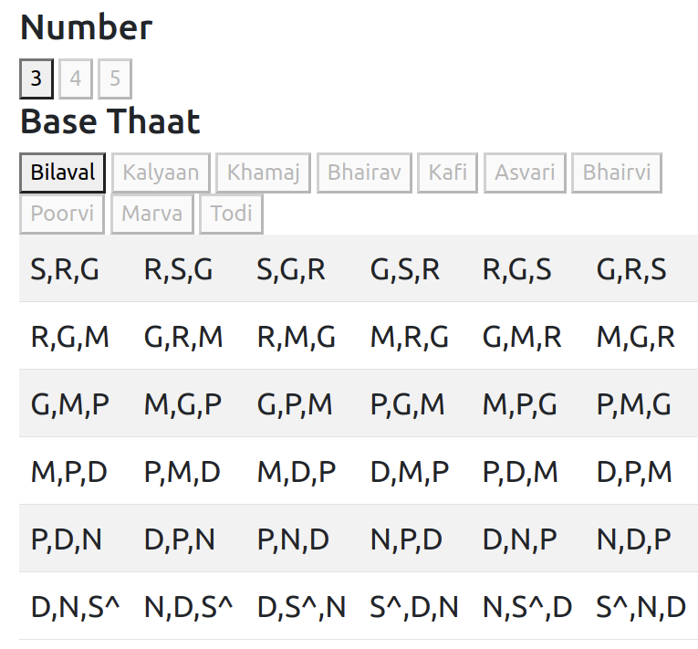

# Meeru Khand Generator

Website to generate Indian raag meeru-khand sequences (skeleton divisions)

[Merukhand](https://en.wikipedia.org/wiki/Merukhand) is an improvisational style in Hindustani classical music involving permutations of a fixed set of swaras or notes (meru, axis or skeleton) broken up in various ways (khand, fragment), while retaining the proper emphasis on various notes as required by the raga.</p>

Hosted using github pages at [meeru-khand.jujhar.com](https://meeru-khand.jujhar.com)



## Deployment

Deploying using github pages (hence the unorthodox use of the `/docs/` directory for publishing)

## Building

```bash
# install deps locally
npm install

# to build prod release in /docs
# you'll need to git commit this
npm run build

# or dev workflow
#browse to http://localhost:8080/
npm run watch
npm run serve
```

### Unit tests

Unit tests for the meeru-khand lib are found in `src/js`

```bash
# to run tests
npm run test
```

## Licence

[MIT](LICENSE)
